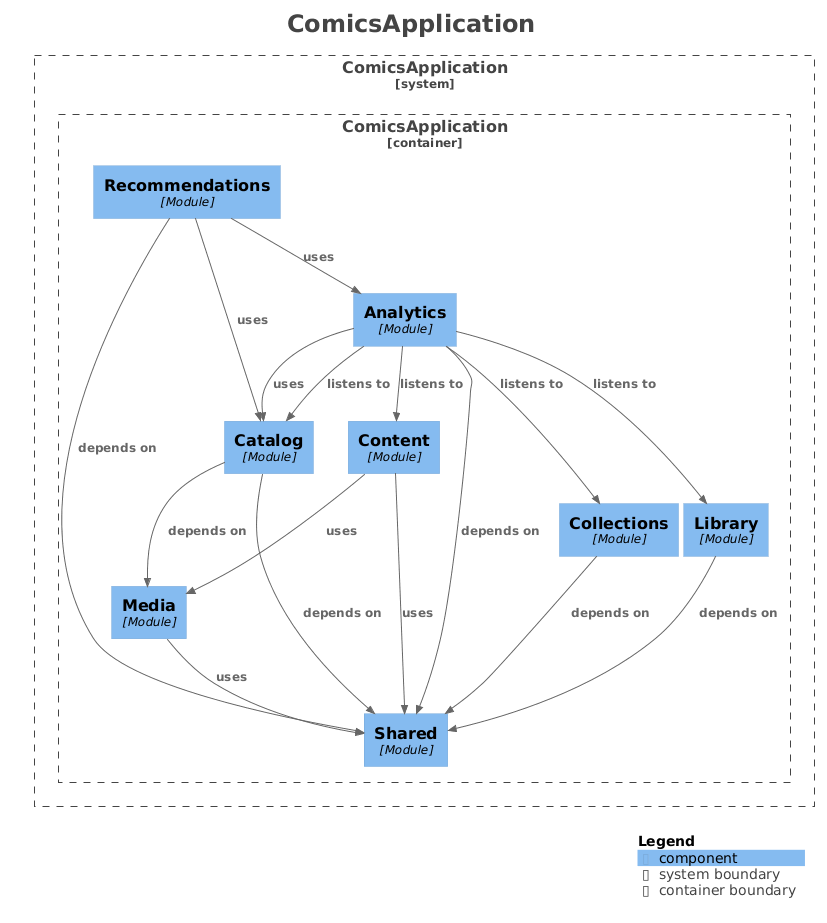

# harakki-comics - сервис для чтения графической литературы

Бэкенд дипломного проекта "Разработка веб-сервиса для чтения графической литературы". Реализован в виде **модульного
монолита** на Spring Boot 4 и Java 25.

## Содержание

- [Технологический стек](#технологический-стек)
- [Архитектура](#архитектура)
- [REST API](#rest-api)
- [Запуск](#запуск)
    - [Требования](#требования)
    - [Локальный запуск](#локальный-запуск)
        - [Dev-профиль](#dev-профиль)
        - [Prod-профиль](#prod-профиль)
    - [Сборка Docker-образа](#сборка-docker-образа)
- [Переменные окружения (prod-профиль)](#переменные-окружения-prod-профиль)
- [OpenAPI / Scalar UI](#openapi--scalar-ui)
- [Лицензия](#лицензия)

---

## Технологический стек

| Компонент        | Технология                          |
|------------------|-------------------------------------|
| Язык             | Java 25                             |
| Фреймворк        | Spring Boot 4                       |
| Архитектура      | Spring Modulith (модульный монолит) |
| База данных      | PostgreSQL 18                       |
| Хранилище медиа  | S3-совместимая БД MinIO             |
| Аутентификация   | Keycloak 26 (OAuth2 / JWT)          |
| Сборка           | Gradle (Kotlin DSL)                 |
| Контейнеризация  | Docker / Jib                        |
| Документация API | SpringDoc OpenAPI 3 + Scalar UI     |
| Маппинг моделей  | MapStruct                           |

---

## Архитектура

Модель C4 для приложения:



Приложение разделено на следующие модули Spring Modulith:

| Модуль            | Пакет                                | Ответственность                                      |
|-------------------|--------------------------------------|------------------------------------------------------|
| `catalog`         | `dev.harakki.comics.catalog`         | Тайтлы (произведения), авторы, издатели и теги       |
| `content`         | `dev.harakki.comics.content`         | Главы, страницы, история прочтения пользователя      |
| `library`         | `dev.harakki.comics.library`         | Личная библиотека пользователя                       |
| `collections`     | `dev.harakki.comics.collections`     | Пользовательские коллекции с параметрами приватности |
| `analytics`       | `dev.harakki.comics.analytics`       | Статистика просмотров и взаимодействий               |
| `recommendations` | `dev.harakki.comics.recommendations` | Персональные тайтлов                                 |
| `media`           | `dev.harakki.comics.media`           | Управление медиафайлами через S3 (MinIO)             |
| `shared`          | `dev.harakki.comics.shared`          | Общие утилиты, исключения и конфигурация приложения  |

---

## REST API

URL по умолчанию: `http://localhost:8080`

Интерактивная документация доступна по адресу: [
`http://localhost:8080/scalar/index.html`](http://localhost:8080/scalar/index.html)

### Тайтлы (произведения) - `/api/v1/titles`

| Метод    | Путь                  | Доступ | Описание                   |
|----------|-----------------------|--------|----------------------------|
| `GET`    | `/api/v1/titles`      | Public | Поиск и фильтрация тайтлов |
| `GET`    | `/api/v1/titles/{id}` | Public | Получить тайтл по UUID     |
| `POST`   | `/api/v1/titles`      | ADMIN  | Создать тайтл              |
| `PATCH`  | `/api/v1/titles/{id}` | ADMIN  | Обновить тайтл             |
| `DELETE` | `/api/v1/titles/{id}` | ADMIN  | Удалить тайтл              |

### Главы - `/api/v1/titles` + `/api/v1/chapters`

| Метод    | Путь                                       | Доступ | Описание                                            |
|----------|--------------------------------------------|--------|-----------------------------------------------------|
| `GET`    | `/api/v1/titles/{titleId}/chapters`        | Public | Список глав тайтла (краткая информация)             |
| `GET`    | `/api/v1/titles/{titleId}/next-chapter`    | USER   | Следующая непрочитанная глава у данного тайтла      |
| `GET`    | `/api/v1/chapters/{chapterId}`             | Public | Полная глава (включая URL страниц)                  |
| `GET`    | `/api/v1/chapters/{chapterId}/read-status` | USER   | Проверка, прочитана ли глава текущим пользователем  |
| `POST`   | `/api/v1/titles/{titleId}/chapters`        | ADMIN  | Создать главу                                       |
| `POST`   | `/api/v1/chapters/{chapterId}/read`        | USER   | Отметить главу как прочитанную и получить следующую |
| `PATCH`  | `/api/v1/chapters/{chapterId}`             | ADMIN  | Обновить метаданные главы                           |
| `DELETE` | `/api/v1/chapters/{chapterId}`             | ADMIN  | Удалить главу                                       |

### Авторы - `/api/v1/authors`

| Метод    | Путь                   | Доступ | Описание                   |
|----------|------------------------|--------|----------------------------|
| `GET`    | `/api/v1/authors`      | Public | Поиск и фильтрация авторов |
| `GET`    | `/api/v1/authors/{id}` | Public | Получить автора по UUID    |
| `POST`   | `/api/v1/authors`      | ADMIN  | Создать автора             |
| `PATCH`  | `/api/v1/authors/{id}` | ADMIN  | Обновить автора            |
| `DELETE` | `/api/v1/authors/{id}` | ADMIN  | Удалить автора             |

### Издатели - `/api/v1/publishers`

| Метод    | Путь                      | Доступ | Описание                     |
|----------|---------------------------|--------|------------------------------|
| `GET`    | `/api/v1/publishers`      | Public | Поиск и фильтрация издателей |
| `GET`    | `/api/v1/publishers/{id}` | Public | Получить издателя по UUID    |
| `POST`   | `/api/v1/publishers`      | ADMIN  | Создать издателя             |
| `PATCH`  | `/api/v1/publishers/{id}` | ADMIN  | Обновить издателя            |
| `DELETE` | `/api/v1/publishers/{id}` | ADMIN  | Удалить издателя             |

### Теги - `/api/v1/tags`

| Метод    | Путь                | Доступ | Описание                         |
|----------|---------------------|--------|----------------------------------|
| `GET`    | `/api/v1/tags`      | Public | Список всех тегов (с пагинацией) |
| `GET`    | `/api/v1/tags/{id}` | Public | Получить тег по UUID             |
| `POST`   | `/api/v1/tags`      | ADMIN  | Создать тег                      |
| `PATCH`  | `/api/v1/tags/{id}` | ADMIN  | Обновить тег                     |
| `DELETE` | `/api/v1/tags/{id}` | ADMIN  | Удалить тег                      |

### Личная библиотека - `/api/v1/library`

| Метод    | Путь                               | Доступ | Описание                                |
|----------|------------------------------------|--------|-----------------------------------------|
| `GET`    | `/api/v1/library`                  | USER   | Получить мою библиотеку                 |
| `GET`    | `/api/v1/library/{titleId}`        | USER   | Запись библиотеки по ID тайтла          |
| `PUT`    | `/api/v1/library/titles/{titleId}` | USER   | Добавить / обновить запись в библиотеке |
| `DELETE` | `/api/v1/library/{entryId}`        | USER   | Удалить запись из библиотеки            |
| `GET`    | `/api/v1/users/{userId}/library`   | Public | Публичная библиотека пользователя       |

### Коллекции - `/api/v1/collections`

| Метод    | Путь                                        | Доступ        | Описание                                            |
|----------|---------------------------------------------|---------------|-----------------------------------------------------|
| `GET`    | `/api/v1/collections`                       | Public        | Поиск публичных коллекций                           |
| `GET`    | `/api/v1/collections/{id}`                  | Public / USER | Получить коллекцию по UUID (публичные - без токена) |
| `GET`    | `/api/v1/collections/my`                    | USER          | Мои коллекции                                       |
| `POST`   | `/api/v1/collections`                       | USER          | Создать коллекцию                                   |
| `PATCH`  | `/api/v1/collections/{id}`                  | USER          | Обновить коллекцию                                  |
| `DELETE` | `/api/v1/collections/{id}`                  | USER          | Удалить коллекцию                                   |
| `POST`   | `/api/v1/collections/{id}/titles/{titleId}` | USER          | Добавить тайтл в коллекцию                          |
| `DELETE` | `/api/v1/collections/{id}/titles/{titleId}` | USER          | Удалить тайтл из коллекции                          |

### Аналитика - `/api/v1/titles`

| Метод | Путь                                 | Доступ | Описание                                       |
|-------|--------------------------------------|--------|------------------------------------------------|
| `GET` | `/api/v1/titles/{titleId}/analytics` | Public | Статистика просмотров/взаимодействий с тайтлом |

### Рекомендации - `/api/v1/recommendations`

| Метод | Путь                         | Доступ | Описание                                              |
|-------|------------------------------|--------|-------------------------------------------------------|
| `GET` | `/api/v1/recommendations/me` | USER   | Рекомендации для текущего пользователя (персональные) |

### Медиа - `/api/v1/media`

| Метод    | Путь                       | Доступ | Описание                                                 |
|----------|----------------------------|--------|----------------------------------------------------------|
| `GET`    | `/api/v1/media/{id}/url`   | Public | Получить presigned URL для скачивания файла              |
| `POST`   | `/api/v1/media/upload-url` | ADMIN  | Сгенерировать presigned URL для загрузки файла на сервер |
| `DELETE` | `/api/v1/media/{id}`       | ADMIN  | Удалить медиафайл                                        |

---

## Запуск

### Требования

Для запуска проекта необходимы установленные следующие компоненты:

- **JDK 25** ([Eclipse Temurin](https://adoptium.net/) или любой другой дистрибутив)
- **Docker** и **Docker Compose**

### Локальный запуск

#### Dev-профиль

Dev-профиль активирован по умолчанию. А Spring Boot автоматически поднимет всю инфраструктуру через
`spring-boot-docker-compose`-зависимость.

> **Настройка переменных окружения**
>
> Файл с переменными окружения находится по указанному пути и уже содержит готовые переменные окружения для быстрого
> старта проекта:
>
> ```
> src/main/docker/.env
> ```

**Запуск приложения**

```bash
./gradlew bootRun
```

После запуска сервисы доступны по адресам:

| Сервис               | URL                                     |
|----------------------|-----------------------------------------|
| API (Backend)        | http://localhost:8080                   |
| Scalar UI (API Docs) | http://localhost:8080/scalar/index.html |
| Swagger UI           | http://localhost:8080/swagger-ui.html   |
| Keycloak Admin       | http://localhost:8081                   |
| MinIO Console        | http://localhost:9001                   |
| PostgreSQL           | localhost:5432                          |

#### Prod-профиль

Настройка prod-профиля требует наличия внешних сервисов (PostgreSQL, MinIO и Keycloak) и правильной конфигурации
переменных окружения проекта (см. раздел [«Переменные окружения (prod-профиль)»](#переменные-окружения-prod-профиль)).

**Запуск приложения**

```bash
./gradlew bootRun --args='--spring.profiles.active=prod'
```

Или через готовый Docker-образ (см. раздел [«Сборка Docker-образа»](#сборка-docker-образа)):

### Сборка Docker-образа

Проект использует [Jib](https://github.com/GoogleContainerTools/jib) для сборки образа приложения.

**Сборка в локальный образ Docker**

```bash
./gradlew jibDockerBuild
```

**Запуск контейнера**

```bash
docker run -p 8080:8080 \
  -e ... # укажите необходимые переменные окружения для prod-профиля \
  harakki-comics:latest
```

---

## Переменные окружения (prod-профиль)

| Переменная               | Описание                                           | Пример                                                                   |
|--------------------------|----------------------------------------------------|--------------------------------------------------------------------------|
| `DATABASE_URL`           | JDBC URL базы данных                               | `jdbc:postgresql://localhost:5432/comics-db`                             |
| `DATABASE_USERNAME`      | Имя пользователя БД                                | `myuser`                                                                 |
| `DATABASE_PASSWORD`      | Пароль пользователя БД                             | `secret`                                                                 |
| `S3_REGION`              | Регион S3/MinIO (по умолчанию `eu-central-1`)      | `eu-central-1`                                                           |
| `S3_ENDPOINT`            | Endpoint S3/MinIO                                  | `http://minio:9000`                                                      |
| `S3_ACCESS_KEY`          | S3 Access Key                                      | `minioadmin`                                                             |
| `S3_SECRET_KEY`          | S3 Secret Key                                      | `minioadmin`                                                             |
| `S3_BUCKET`              | Имя S3-бакета                                      | `comics-bucket`                                                          |
| `JWT_ISSUER_URI`         | URI издателя JWT (Keycloak realm)                  | `http://keycloak:8081/realms/comics-realm`                               |
| `JWT_JWK_SET_URI`        | URI публичных ключей Keycloak                      | `http://keycloak:8081/realms/comics-realm/protocol/openid-connect/certs` |
| `JWT_CONNECT_TIMEOUT`    | Таймаут подключения к Keycloak (по умолчанию `2s`) | `5s`                                                                     |
| `JWT_READ_TIMEOUT`       | Таймаут чтения от Keycloak (по умолчанию `2s`)     | `5s`                                                                     |
| `MANAGEMENT_SERVER_PORT` | Порт Spring Actuator (по умолчанию `8081`)         | `8081`                                                                   |

---

## OpenAPI / Scalar UI

Документация API автоматически генерируется через `SpringDoc OpenAPI` после запуска приложения и доступна по следующим
URL (при запуске на `localhost:8080` в dev-профиле):

- **Scalar UI** (рекомендуется): [`http://localhost:8080/scalar/index.html`](http://localhost:8080/scalar/index.html)
- **Swagger UI**: [`http://localhost:8080/swagger-ui.html`](http://localhost:8080/swagger-ui.html)
- **OpenAPI JSON**: [`http://localhost:8080/v3/api-docs`](http://localhost:8080/v3/api-docs)

Для защищённых эндпоинтов необходимо передать `Bearer`-токен, полученный от Keycloak:

```
Authorization: Bearer <JWT-токен>
```

Для получения токена используйте Keycloak Token Endpoint:

```
POST http://localhost:8081/realms/comics-realm/protocol/openid-connect/token
```

---

## Лицензия

Этот проект лицензирован под [Apache License 2.0](LICENSE). Вы можете свободно использовать, изменять и распространять
этот код в соответствии с условиями лицензии.
